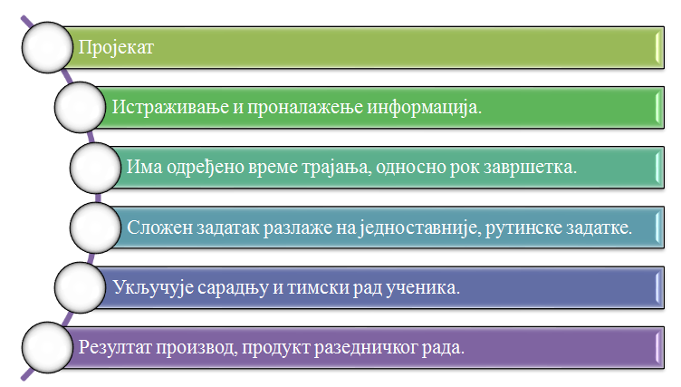

Пројектна настава
=================

.. infonote::

   Дошло је време да након изучавања тема Информационо-комуникационе технологије и Дигитална писменост, покажеш шта знаш.
   Током наредна три часа заједно са својим друговима и другарицама из одељења, бавићеш се израдом истраживачког школског пројекта.
   Приликом рада на изради пројекта потребно је да се позабавите реалним животим ситуацијама у којима можете да примените усвојена знања и стечене вештине из претходних лекција.
   Током рада на истраживачком пројекту као извор информација користићете интернет, књиге, уџбенике и питаћете наставнике и родитеље.

Пројекат је сложена активност која садржи више фаза и траје одређено време. Пре почетка рада на самом пројекту, потребно је размотрити следеће:

* *Идеја* - шта ће бити наш истраживачки задатак на коме чемо радити;
* *Партнери* - ко ће бити сарадници на пројекту са којима ћемо радити у тиму;
* *План тема* - одредити конкретније задатке на којима ћемо радити и шта ће бити тема пројекта;
* *План активности* - одредити на који начин ћемо радити;
* *План реализације* - одредити временску динамику када ћемо реализовати које активности;
* *План програма и алата* - одредити које ћемо програме и алате користити за рад;
* *Резултати* - одредити шта ће бити продукти које ћемо приказати на крају пројекта.

Радом на пројекту самостално или у тиму, током наредна три часа (или у одређеном дефинисаном временском периоду) истраживаћеш (проналазићеш релевантне информације) и откриваћеш (проналазићеш нове, непознате чињенице) о теми која је теби и твојим друговима и другарицама интересантна, поставићеш решење проблема и на крају ћеш га јавно представити као коначан продукт вашег заједичког рада.

