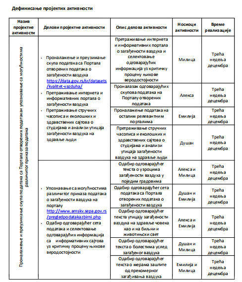
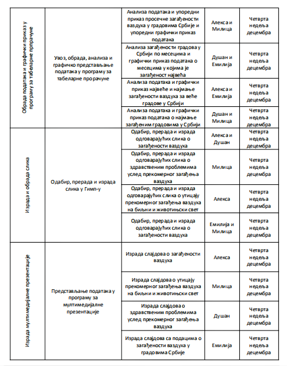
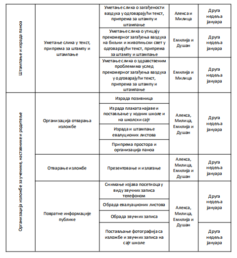
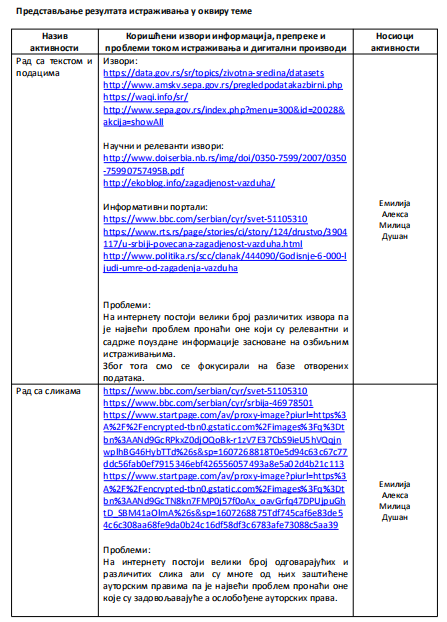
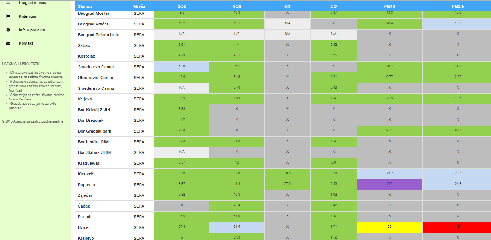
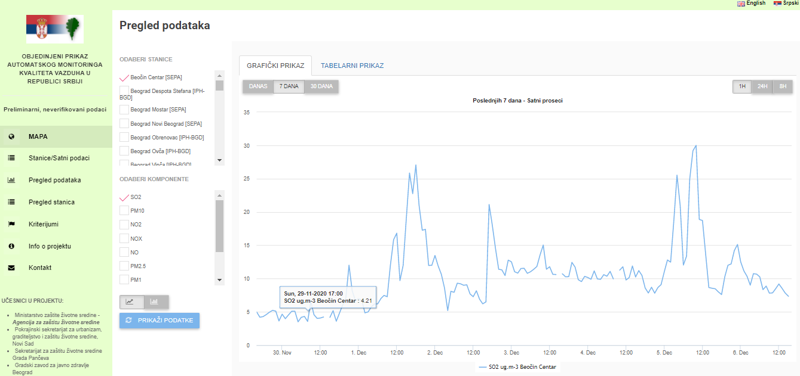
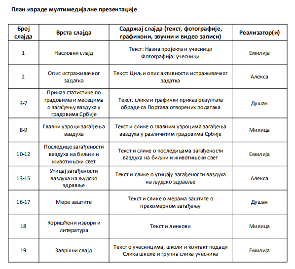
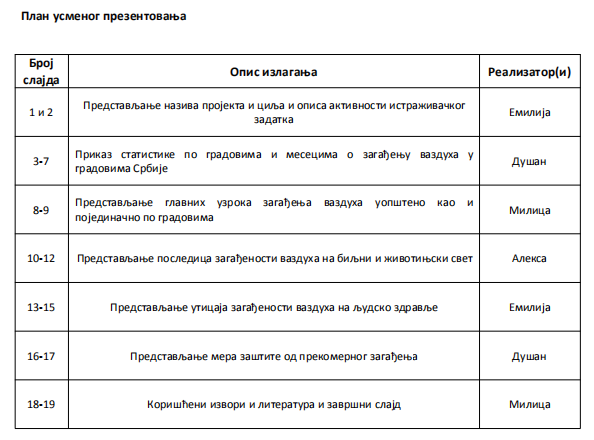
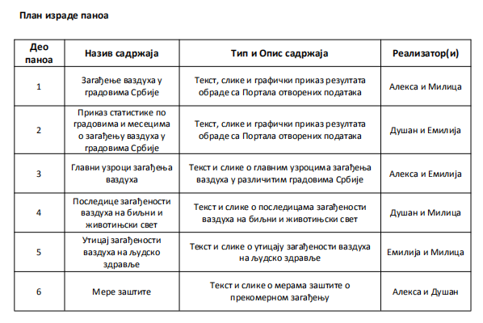

Рад на пројекту
================

.. infonote::

   Tоком овог часа:

   * у оквиру тима, дефинисаћете пројектне активности;
   * одредићете улоге у тиму, односно ко ће појединачно бити задужен за реализацију сваке од дефинисаних активности;
   * одредићете временску динамику реализације пројектних активности, односно дефинисати временске оквире за које ће свако реализовати своје активности;
   * представити резултате свим члановима тима. 

Оно што је најважније јесте да ћете презентовати добијене резултате истраживања о теми коју сте одабрали. У нашем случају креираћемо мултимедијалну презентацију са анализом квалитета ваздуха у градовима Србије.
Такође, добијене резултате ћемо одштампати и заједно са пратећим текстом уз илустрацију сликама направити пано који ћемо изложити у холу школе. 

Чланови тима: Емилија, Милица, Алекса и Душан

Кроз доњу табелу ћемо демонстрирати како ћете дефинисати пројектне активности, и како ће распоредити улоге у тиму и рок за завршетак планираних активнисти

Представљање резултата истраживања у оквиру тима

Потребно је да осмислите мултимедијалну презентацију и пано како бисте представили резултата пројекта. 
Можете да користите примере илустрације података са портала http://www.amskv.sepa.gov.rs/pregledpodatakazbirni.php

План израде мултимедијалне презентације

Током осмишљавања презентације потребно је да осмислите и сценарио за усмену презентацију, као и да дефинишете улоге за сваког члана тима током презентовања.

План израде паноа

